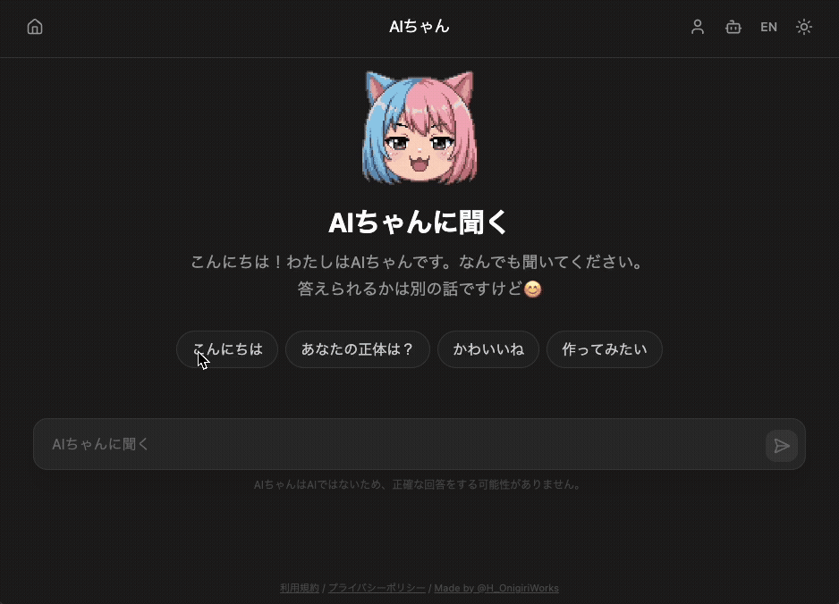
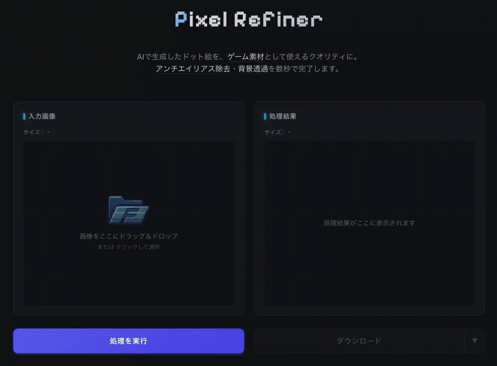

## HappyOnigiri

「思いつきドリブン開発」で、面白そう・便利そうなものを作る個人開発者です。

### Products

| Name | Description | Link |
|------|-------------|------|
| AIちゃん | AIを一切使わずに「AIキャラ」を作れるサービス | [ai-chan.app](https://ai-chan.app) |
| PixelRefiner | AI生成ドット絵を素材・アイコン品質に変換 | [pixel-refiner.app](https://www.pixel-refiner.app/) |
| ComfyUI-Meld | ComfyUI向け画像管理・検索・系譜追跡拡張 | [GitHub](https://github.com/HappyOnigiri/ComfyUI-Meld) |
| Refix | CIエラー解消からマージまでPRプロセスを自動化 | [GitHub](https://github.com/HappyOnigiri/Refix) |

デモ (Demo)

#### AIちゃん

AIを一切使わずに「AIキャラ」を作れるサービス『AIちゃん』

✅ アカウント登録なし 
✅ ブラウザだけで完結 
✅ 推しキャラもオリキャラも自由に設定 

▶ https://ai-chan.app

#### PixelRefiner

AI生成ドット絵を素材品質に仕上げるツール『Pixel Refiner』

✅ 完全無料・登録不要 
✅ ブラウザ完結（画像はサーバーに送られません） 
✅ ぼやけ除去・背景透過・レトロパレット変換 

▶ https://pixel-refiner.app

### Links

[Profile](https://happy-onigiri.dev/) / [X](https://x.com/H_OnigiriWorks) / [Zenn](https://zenn.dev/happy_onigiri) / [note](https://note.com/happy_onigiri)
